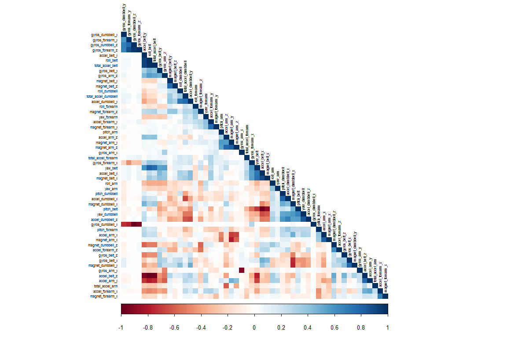
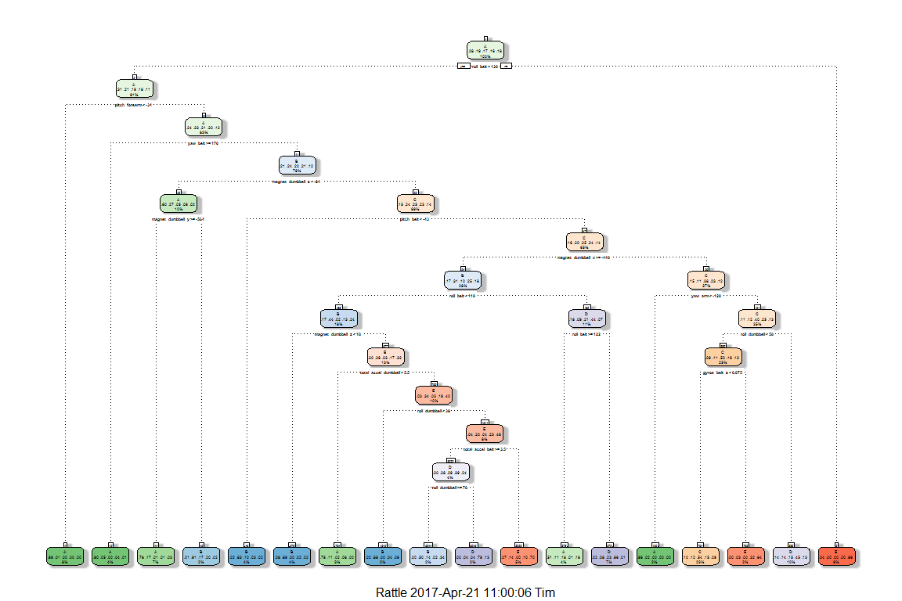
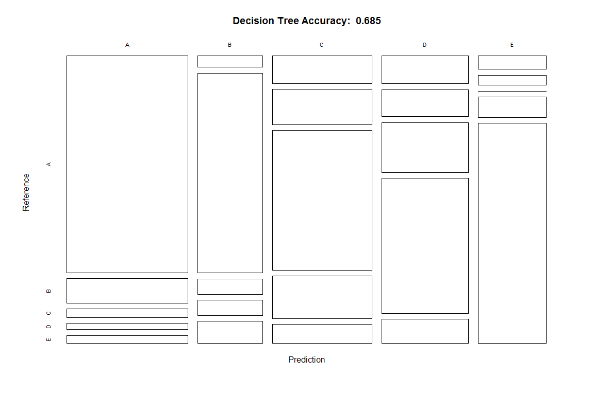
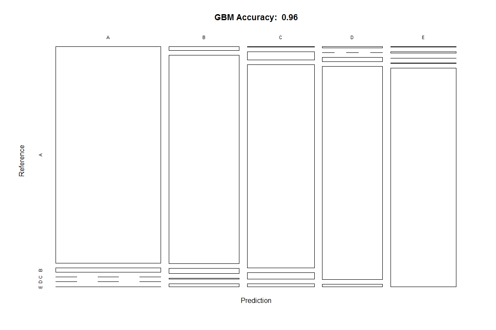
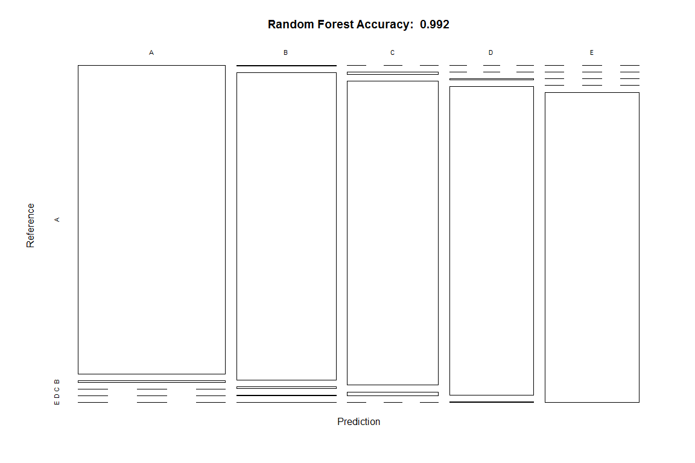

Practical Machine Learning Course Project
================
Tim Bowler
April 20, 2017

Overview
--------

Using devices such as Jawbone Up, Nike FuelBand, and Fitbit it is now possible to collect a large amount of data about personal activity relatively inexpensively. These type of devices are part of the quantified self movement - a group of enthusiasts who take measurements about themselves regularly to improve their health, to find patterns in their behavior, or because they are tech geeks. One thing that people regularly do is quantify how much of a particular activity they do, but they rarely quantify how well they do it. In this project, your goal will be to use data from accelerometers on the belt, forearm, arm, and dumbell of 6 participants. They were asked to perform barbell lifts correctly and incorrectly in 5 different ways. More information is available from the website here:

-   [Weight Data](http://groupware.les.inf.puc-rio.br/har)

(see the section on the Weight Lifting Exercise Dataset)

Environment Prep and Data Loading
---------------------------------

R libraries required for the analyis are loaded.

``` r
knitr::opts_chunk$set(fig.width = 12, fig.height = 8, warning = FALSE, message = FALSE)
```

``` r
library(caret, quietly = TRUE); library(rpart, quietly = TRUE); library(rpart.plot, quietly = TRUE)
library(rattle, quietly = TRUE); library(randomForest, quietly = TRUE); library(corrplot, quietly = TRUE)
library(gbm, quietly = TRUE); library(survival, quietly = TRUE); library(splines, quietly = TRUE)
library(parallel, quietly = TRUE); library(plyr, quietly = TRUE)
```

The data required for the analysis is loaded from the following urls and assigned to a Training/Cross Validation variable and a Test Case variable.

``` r
urlTrain <- "https://d396qusza40orc.cloudfront.net/predmachlearn/pml-training.csv"
urlTest <- "https://d396qusza40orc.cloudfront.net/predmachlearn/pml-testing.csv"

trainData <- read.csv(url(urlTrain))
testCase <- read.csv(url(urlTest))
```

The Training data are partitioned into a training set (70%) and a cross-val/test set (30%).

``` r
inTrain <- createDataPartition(y = trainData$classe, p = 0.7, list = FALSE)
training <- trainData[inTrain, ]
testing <- trainData[-inTrain, ]
dim(training)
```

    ## [1] 13737   160

``` r
dim(testing)
```

    ## [1] 5885  160

Data Cleaning
-------------

### Remove Near Zero Variance variables

A cursory examination of the data via str and head showed that there are a number of variables that have little to no variability, and thus wouldn't be useful in any model. These are removed from the training and testing sets.

``` r
NZVvariables <- nearZeroVar(training)
training <- training[, -NZVvariables]
testing <- testing[, -NZVvariables]

dim(training)
```

    ## [1] 13737   104

``` r
dim(testing)
```

    ## [1] 5885  104

### Remove NA variables

There are also a number of variables with large numbers of 'NA' values, and the first six variables are ID classifier variables that wouldn't contribute explanatory value. These are removed via a two-step process.

#### 1. Format variables as numerics

``` r
for(i in c(8:ncol(training) - 1)){
      training[, i] <- as.numeric(as.character(training[, i]))
      testing[, i] <- as.numeric(as.character(testing[, i]))
}
```

#### 2. Remove NA's and initial six ID variables

``` r
goodVars <- colnames(training[colSums(is.na(training)) == 0])
goodVars <- goodVars[-c(1:6)]

training <- training[, goodVars]
testing <- testing[, goodVars]
dim(training)
```

    ## [1] 13737    53

``` r
dim(testing)
```

    ## [1] 5885   53

The resulting datasets are reduced to 52 predictor variables and the result variable ('classe').

Exploratory Graph
-----------------

An exploratory correlation matrix is produced.

``` r
corrMatrix <- cor(x = training[, -53])
corrplot(corr = corrMatrix, method = "color", type = "lower", order = "hclust", 
         hclust.method = "complete", diag = TRUE, tl.cex = 0.5, tl.col = "black")
```



The matrix demonstrates that there are few highly correlated variables among the 52 remaining predictors, so removing them would make little difference in improving model parsimony.

Prediction Models
-----------------

Based on the large number of possible predictor variables, three prediction models will be assesed: Decision Tree analysis, the Generalized Boost Model (GBM), and the Random Forest model. Model accuracy will be the primary criteria to assess model effectiveness, so a confusion matrix and the resulting accuracy will be reported for each.

### Decision Tree

``` r
set.seed(7769)
modDT <- rpart(formula = classe ~ ., data = training, method = "class")
fancyRpartPlot(model = modDT)
```



``` r
predDT2 <- predict(object = modDT, newdata = testing, type = "class")
confuseDT <- confusionMatrix(data = predDT2, reference = testing$classe)
confuseDT$table
```

    ##           Reference
    ## Prediction    A    B    C    D    E
    ##          A 1486  181   19   55   15
    ##          B   59  686  107   87  109
    ##          C   48  137  835  157  116
    ##          D   54  107   65  604   74
    ##          E   27   28    0   61  768

``` r
confuseDT$overall[1]
```

    ##  Accuracy 
    ## 0.7440952

``` r
plot(confuseDT$table, col = confuseDT$byClass, 
     main = paste("Decision Tree Accuracy: ", round(x = confuseDT$overall[1], digits = 3)))
```



### Generalized Boost Model

``` r
set.seed(7769)
ctrlGBM <- trainControl(method = "repeatedcv", number = 5, repeats = 1)
modFitGBM <- train(form = classe ~ ., data = training, method = "gbm", 
                   trControl = ctrlGBM, verbose = FALSE)

predGBM <- predict(object = modFitGBM, newdata = testing)
confusionGBM <- confusionMatrix(data = predGBM, reference = testing$classe)
confusionGBM$table
```

    ##           Reference
    ## Prediction    A    B    C    D    E
    ##          A 1646   41    1    2    2
    ##          B   18 1075   32    3   11
    ##          C    6   22  975   30    6
    ##          D    3    1   14  920   16
    ##          E    1    0    4    9 1047

``` r
confusionGBM$overall[1]
```

    ## Accuracy 
    ## 0.962277

``` r
plot(confusionGBM$table, col = confusionGBM$byClass, 
     main = paste("GBM Accuracy: ", round(x = confusionGBM$overall[1], digits = 3)))
```



### Random Forest

``` r
set.seed(7769)
modFitRF <- train(form = classe ~ ., data = training, method = "rf", 
                  trControl = trainControl(method = "cv", number = 5, verboseIter = FALSE))

predRF <- predict(object = modFitRF, newdata = testing)
confusionRF <- confusionMatrix(data = predRF, reference = testing$classe)
confusionRF
```

    ## Confusion Matrix and Statistics
    ## 
    ##           Reference
    ## Prediction    A    B    C    D    E
    ##          A 1673   12    0    0    0
    ##          B    0 1127    6    0    0
    ##          C    0    0 1019   24    1
    ##          D    0    0    1  939    1
    ##          E    1    0    0    1 1080
    ## 
    ## Overall Statistics
    ##                                           
    ##                Accuracy : 0.992           
    ##                  95% CI : (0.9894, 0.9941)
    ##     No Information Rate : 0.2845          
    ##     P-Value [Acc > NIR] : < 2.2e-16       
    ##                                           
    ##                   Kappa : 0.9899          
    ##  Mcnemar's Test P-Value : NA              
    ## 
    ## Statistics by Class:
    ## 
    ##                      Class: A Class: B Class: C Class: D Class: E
    ## Sensitivity            0.9994   0.9895   0.9932   0.9741   0.9982
    ## Specificity            0.9972   0.9987   0.9949   0.9996   0.9996
    ## Pos Pred Value         0.9929   0.9947   0.9761   0.9979   0.9982
    ## Neg Pred Value         0.9998   0.9975   0.9986   0.9949   0.9996
    ## Prevalence             0.2845   0.1935   0.1743   0.1638   0.1839
    ## Detection Rate         0.2843   0.1915   0.1732   0.1596   0.1835
    ## Detection Prevalence   0.2863   0.1925   0.1774   0.1599   0.1839
    ## Balanced Accuracy      0.9983   0.9941   0.9940   0.9868   0.9989

``` r
plot(confusionRF$table, col = confusionRF$byClass, 
     main = paste("Random Forest Accuracy: ", round(x = confusionRF$overall[1], digits = 3)))
```



Result
------

Hierarchical rank-ordering of model accuracy shows that Random Forest is the preferred model.

1.  RF Accuracy: 0.9920136
2.  GBM Accuracy: 0.962277
3.  DT Accuracy: 0.7440952

Test Case Predictions
---------------------

The Random Forest model applied to the Test Case data results in the following predictions:

``` r
predTESTCASE <- predict(object = modFitRF, newdata = testCase)
predTESTCASE
```

    ##  [1] B A B A A E D B A A B C B A E E A B B B
    ## Levels: A B C D E
